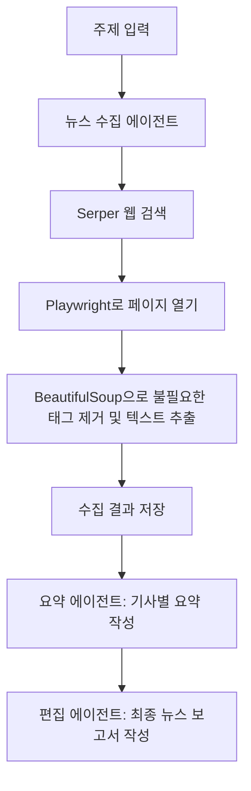

# 뉴스 수집·요약 에이전트

주제를 입력하면 CrewAI 에이전트 세 명이 검색, 기사 요약, 최종 보고서 작성을 순서대로 수행합니다. 기본 검색 주제는 `Meta AI`입니다.

## 준비 사항

- Python 3.13 및 uv
- OpenAI API 키: 에이전트의 언어 모델 호출에 사용
- Serper API 키: 웹 검색에 사용
- Playwright Chromium: 웹페이지를 열어 HTML을 가져오는 브라우저

## 설치 및 실행

저장소 루트에서 PowerShell로 실행합니다.

```powershell
cd news-reader-agent
uv sync --locked
uv run playwright install chromium
Copy-Item .env.example .env
```

`.env`에 본인의 키를 입력하세요. 이미 `.env`가 있다면 복사 단계는 건너뜁니다.

```dotenv
OPENAI_API_KEY=your_openai_api_key_here
SERPER_API_KEY=your_serper_api_key_here
```

프로젝트 폴더에서 실행합니다.

```powershell
$env:PYTHONIOENCODING = "utf-8"
uv run main.py
```

진행 상황은 터미널에 표시되며, 완료되면 `output/`에 Markdown 파일이 생성됩니다. 재실행하면 기존 결과 파일을 갱신합니다. API 호출에 사용량이 발생하며 검색 결과 수와 접속 속도에 따라 실행 시간이 달라집니다.

## 검색 주제와 결과 수 바꾸기

`main.py`의 `topic`을 원하는 주제로 바꿉니다.

```python
result = NewsReaderAgent().crew().kickoff(inputs={"topic": "Meta AI"})
```

`tools.py`의 `n_results`로 검색 호출당 결과 수를 지정합니다. 기본값은 5이며, 최종 보고서의 기사 수를 고정하는 값은 아닙니다. 에이전트가 여러 번 검색하거나 일부 기사를 제외할 수 있습니다.

```python
search_tool = SerperDevTool(
    n_results=5,
)
```

## 작동 원리



1. `main.py`가 `.env`와 YAML 설정을 읽고 에이전트와 작업을 연결합니다.
2. `news_hunter_agent`가 `search_tool`로 주제 관련 페이지를 검색하고 `scrape_tool`로 기사 본문을 읽습니다.
3. `scrape_tool`은 화면을 띄우지 않는 Chromium으로 URL을 열고 5초 기다린 뒤 HTML을 가져옵니다. BeautifulSoup으로 메뉴·스크립트 등 지정된 태그를 제거하고 텍스트를 반환합니다.
4. `summarizer_agent`가 앞 작업의 기사 URL을 바탕으로 본문을 다시 읽고 짧은 요약, 핵심 요약, 상세 요약을 만듭니다.
5. `curator_agent`가 앞 작업의 결과를 묶어 최종 보고서를 작성합니다. 실행은 CrewAI의 기본 순차 방식으로 진행됩니다.

`@tool`은 Python 함수를 에이전트가 호출할 수 있는 도구로 등록합니다. 함수 설명과 `url: str` 같은 입력 정보가 모델의 도구 선택에 사용됩니다. YAML은 에이전트의 역할과 작업 지시를 정의하고, 실제 검색과 페이지 접속은 Python 도구가 수행합니다.

## 생성되는 결과

| 파일 | 내용 |
|---|---|
| `output/content_harvest.md` | 수집한 기사와 출처, 날짜, 관련성 등 |
| `output/summary.md` | 기사별 단계별 요약 |
| `output/final_report.md` | 주요 뉴스와 분석을 합친 최종 보고서 |

결과 파일은 실행 시 생성하며 저장소에는 포함하지 않습니다. 현재 YAML은 영어 지시문이므로 보고서도 주로 영어로 생성됩니다. 한국어 보고서가 필요하면 각 작업의 `description`과 `expected_output`에 한국어 작성 조건을 추가하세요.

## 파일 구성

```text
news-reader-agent/
├── main.py
├── tools.py
├── config/
│   ├── agents.yaml
│   └── tasks.yaml
├── .env.example
├── .python-version
├── pyproject.toml
├── uv.lock
└── README.md
```

`agents.yaml`은 세 에이전트의 역할과 모델 설정을 담습니다. 현재 요약 에이전트는 `openai/o3`를 지정하고 나머지는 CrewAI 기본 모델 설정을 사용합니다. `tasks.yaml`은 수집 조건, 출력 형식과 저장 경로를 정의합니다.

## 현재 구현의 범위와 오류 확인

- 최근 48시간 기사 선별은 **YAML 지시를 받은 모델의 판단**입니다. 현재 기본 도구에는 검색 기간 제한이나 발행일을 검사하는 코드가 없으므로 최신성은 보장되지 않습니다.
- `scrape_tool`은 페이지 전체에서 태그를 제거하므로 기사 외의 관련 링크나 안내 문구가 섞일 수 있습니다.
- 추출한 텍스트가 빈 문자열이면 `No content`를 반환합니다. 접속 실패나 시간 초과는 현재 함수에서 별도로 처리하지 않아 도구 오류로 나타날 수 있습니다.
- `Executable doesn't exist` 오류가 나면 `uv run playwright install chromium`을 실행하세요.
- `SERPER_API_KEY` 또는 인증 오류가 나면 `.env`의 키와 API 이용 가능 상태를 확인하세요.
- 사이트 차단, 로그인 요구, 30초 접속 시간 초과로 일부 기사를 읽지 못할 수 있습니다. 검색 결과가 곧 최종 기사 수는 아닙니다.
- 결과가 없을 때에는 오래된 기사를 대신 채우지 않고 결과 없음으로 보고하도록 지시했습니다. 생성된 날짜·주장·출처는 원문과 함께 확인하세요.
